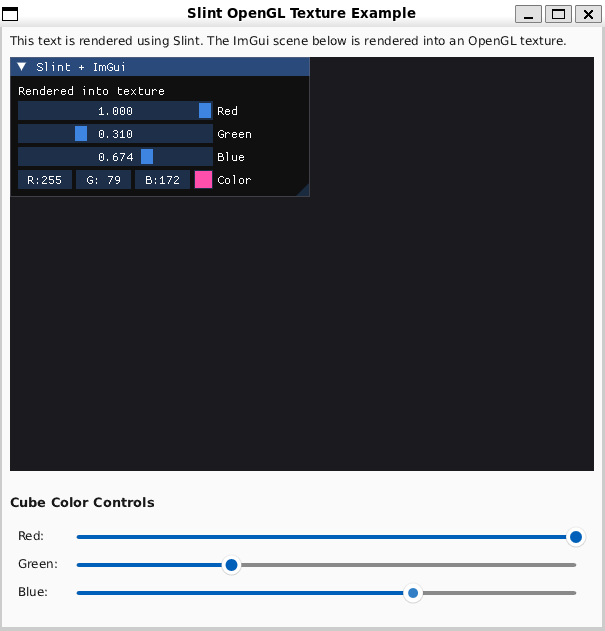

# Slint-ImGui
Embedding a Dear ImGui window inside Slint GUI for interactive plotting in C++.

<p align="center">
  
</p>

## Why?
To my knowledge, as of now Slint doesn't yet support interactive plotting.
This project is a workaround to utilize [ImGui](https://github.com/ocornut/imgui) and [ImPlot](https://github.com/epezent/implot) for creating interactive plots inside a Slint application.
I probably should have sought a different approach, but it was an opportunity to learn a bit more about Slint, ImGui and OpenGL.

## How?
The ImGui window is embedded in a Slint window. The ImGui window is rendered into an OpenGL texture and displayed in the Slint window as an Image component.
Custom rendering notifier is used to render the ImGui window into the OpenGL texture, and capture mouse events from the Slint window to the ImGui window.

TBD: Capture keyboard events.

This was based on the [opengl_texture](https://github.com/slint-ui/slint/tree/master/examples/opengl_texture) Slint example.

A custom candlestick plot example from [ImPlot](https://github.com/epezent/implot/blob/master/implot_demo.cpp#L2152) was also integrated to demonstrate the functionality.

## Running
### Prerequisites (installed separately):
- CMake
- OpenGL ES 3.0
- Slint

### Dependencies (built together):
- ImGui
- ImPlot

### Build and run:
Complied with C++23 but should work with older versions with some minor changes.
```
cmake -B build -DCMAKE_BUILD_TYPE=Debug
cmake --build build
./build/slint-imgui
```

## Disclaimer
This project is just a small demo with no real testing. Do with it as you wish, but don't expect greatness.
